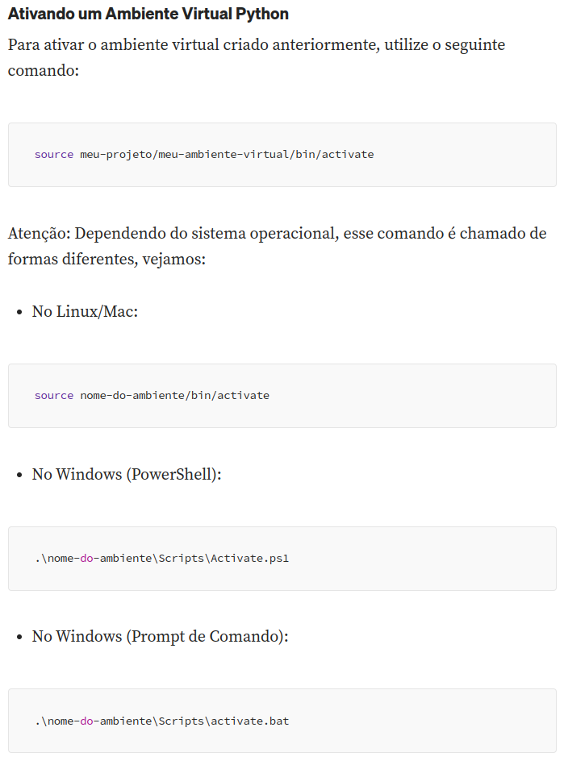

### Intruções de Instalação

1. Clone o projeto:

   ```markdown
   git clone https://github.com/zairobastos/obiscraping.git
   ```
2. Instale o venv:

   ```python
   pip install virtualenv
   ```
3. Crie um ambiente virtual:

   ```python
   python3 -m venv .venv
   ```



[Veja mais detalhes do virtualenv](https://medium.com/@habbema/python-virtual-environments-venv-8d3696fc47e5)

4. Instalando as bibliotecas necessárias:

```python
pip install -r requirements.txt
```
